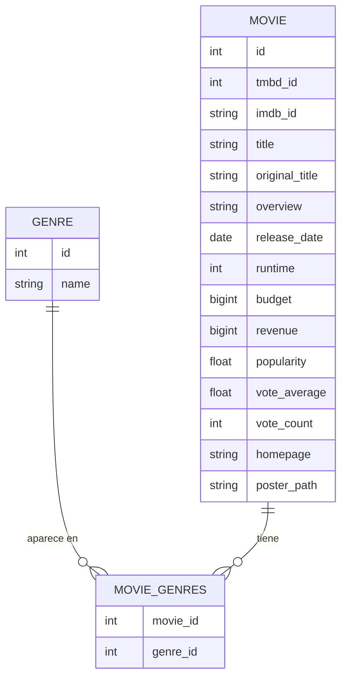

# crud django Peliculas
_Proyecto de ejemplo con Django 5 + MariaDB: catálogo de películas con géneros, búsqueda, filtros por género, paginación y CRUD (crear, editar, borrar). Incluye semilla de datos (dump.sql) para cargar rápidamente._

## Requisitos

- Django 5.2
- MariaDB 11
- Python 3.11
- Docker (Opcional)
- Paquetes del sistema para mysqlclient

Modelos:


## Modelos




## Ejecutar el programa


1 Clonar y entorno
```
git clone https://github.com/GeraMaldonado/django_crud.git
cd django_crud

python -m venv .venv
source .venv/bin/activate
pip install -r requeriments.txt
```


2 Variables de entorno

Crear `.env` on la siguiente información:
```
DB_NAME=nombre_de_base_de_datos
DB_USER=usuario_de_base_de_datos
DB_PASSWORD=contraseña_para_el_usuario
DB_HOST=127.0.0.1 #Ejemplo de host local
DB_PORT=3306 #Ejemplo de puerto default

```

3 Levantar MariaDB con Docker (opcional)

```
#En raíz del proyecto
docker compose up -d mariadb

```

4 Crear esquema (migraciones)
```
python manage.py migrate
```


5 Cargar semilla

dump.sql solo tiene datos (INSERT)


6) Correr servidor
```
python manage.py runserver
```

## Rutas clave

- `/` (raíz) —> Lista de películas

- `/movies/<pk>/` —> Detalle de película

- `/movies/create/` —> Crear película

- `/movies/<pk>/edit/` —> Editar película

- `/movies/<pk>/delete/` —> Eliminar película.

- `/admin/` —> Admin de Django (Ya integrado)

## Usuarios demo

Aun no se incluyen usuarios


## Estructura del proyecto (tree)

```
./
├── catalog
│   ├── admin.py
│   ├── apps.py
│   ├── forms.py
│   ├── migrations
│   │   ├── 0001_initial.py
│   │   ├── 0002_alter_movie_homepage.py
│   ├── models.py
│   ├── tests.py
│   ├── urls.py
│   └── views.py
├── core
│   ├── asgi.py
│   ├── settings.py
│   ├── urls.py
│   └── wsgi.py
├── docker-compose.yml
├── dump.sql
├── manage.py
├── README.md
├── requeriments.txt
└── templates
    ├── base.html
    └── catalog
        ├── movie_confirm_delete.html
        ├── movie_detail.html
        └── movie_list.html
└─ manage.py
```

